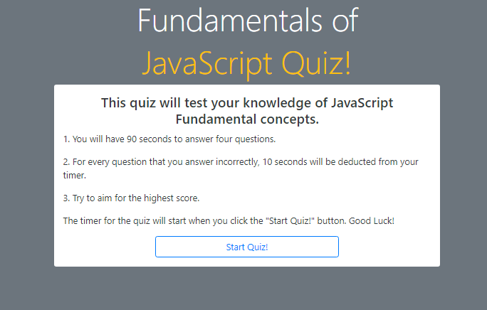

# Code-Quiz

## Description 

This application is a quiz that tests the user on fundamental concepts of JavaScript. Upon this project's completion, the user will be assessed on basic concepts and will have 90 seconds to answer four questions. For every question that they answer incorrectly, the user will have 10 seconds deducted from their timer. When the user completes the quiz, they can submit their name and score to the scoreboard of the quiz. 

🚧 This application is currently a work-in-progress.🚧

## Table of Contents 
* [Website](#website)
* [Credits](#credits)
<!-- * [Contributors](#contributors) -->

## Website
Here is a link to the live website:
[Fundamentals of JS Quiz](https://vtori37.github.io/Code-Quiz/)

## Author
[Victoria Rice](https://github.com/vtori37)

<!-- ## Contributors
The following individuals helped assit me in building this code:
 -->
## Credits
* HTML5
* CSS 
* JS
* Bootstrap 5.0
--- 

<!--
--User Story--
AS A coding boot camp student
I WANT to take a timed quiz on JavaScript fundamentals that stores high scores
SO THAT I can gauge my progress compared to my peers

--Acceptance Criteria--
GIVEN I am taking a code quiz:

WHEN I click the start button
THEN a timer starts and I am presented with a question

WHEN I answer a question
THEN I am presented with another question

WHEN I answer a question incorrectly
THEN time is subtracted from the clock

WHEN all questions are answered or the timer reaches 0
THEN the game is over

WHEN the game is over
THEN I can save my initials and score
-->

